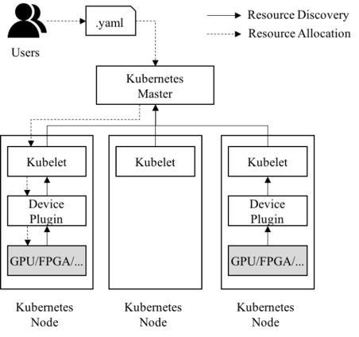
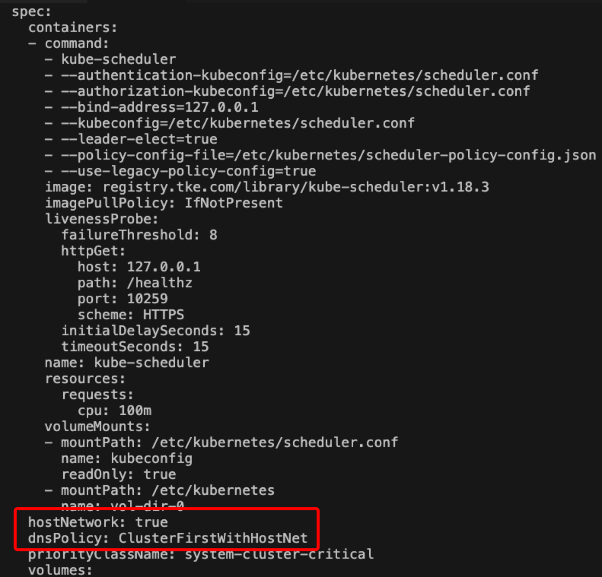

# GPU虚拟化简介-0.1版本
GPU是一种用于矩阵计算的PCIe设备，一般用于解码、渲染和科学计算等[并行计算](https://cloud.tencent.com/product/gpu?from=20065&from_column=20065)场景，不同场景对GPU使用方式不同，使用的加速库也各不相同，本文提到的GPU虚拟化主要针对科学计算场景，使用的加速库为nvidia cuda。

从用户角度，GPU虚拟化可以简单分为两种类型，虚拟机层面的虚拟化和[容器](https://cloud.tencent.com/product/tke?from=20065&from_column=20065)层面的虚拟化。虚拟机层面的虚拟化是将GPU硬件设备虚拟给多个KVM虚拟机使用，各个虚拟机独立安装驱动，这样既保证了虚拟机内的GPU功能完备又实现GPU资源的隔离和共享，唯一缺点就是资源损耗相对较大。容器层面的虚拟化则有两个思路，一个是将GPU纳入cgroup管理，目前尚未有成熟的提案，短期内难以实现，二是基于GPU驱动封装实现，用户根据需要对驱动的某些关键接口（如显存分配、cuda thread创建等）进行封装劫持，在劫持过程中限制用户进程对计算资源的使用，此类方案缺点是兼容性依赖于厂商驱动，但是整体方案较为轻量化，性能损耗极小。GPUManager即为第二类容器层面的虚拟化方案，本文主要介绍GPUManager方案原理和部署流程。 

# GPUManager架构介绍

  GPUManager是一个运行在k8s上的GPU虚拟化方案，了解GPUManager方案架构前我们先看一下k8s对异构资源的支持。1.6版本开始，k8s的in-tree代码里开始引入Nvidia GPU相关的代码，但不支持GPU调度无法在实际生产环境中使用，为了满足越来越多的异构资源（如GPU、Infiniband、FPGA等）使用需求，1.8版本社区提出了Extended Resource和Device Plugin方案，以OutOfTree形式支持异构资源的调度和映射。

​    Device Plugin：K8s制定设备插件接口规范，定义异构资源的上报和分配，设备厂商只需要实现相应的API接口，无需修改kubelet源码即可实现对其他硬件设备的支持。

​    Extended Resource：Scheduler可以根据Pod的创建删除计算资源可用量，而不再局限于CPU和内存的资源统计，进而将有特殊资源需求的Pod调度到相应的节点上。

​    通过Device Plugin 异构资源调度流程如下：

1. Device plugin 向kubelet上报当前节点资源情况
2. 用户通过yaml文件创建负载，定义Resource Request
3. kube-scheduler根据从kubelet同步到的资源信息和Pod的资源请求，为Pod绑定合适的节点
4. kubelet监听到绑定到当前节点的Pod，调用Device plugin的allocate接口为Pod分配设备
5. kubelet启动Pod内的容器，将设备映射给容器



至此，第三方设备厂商如Nvidia、AMD、Intel，可以通过各自的Device Plugin满足用户在k8s上使用异构资源的需求，Nvidia还针对GPU实现了自己的[docker](https://cloud.tencent.com/product/tke?from=20065&from_column=20065) runtime以更优雅的形式解决设备映射和驱动目录映射问题。然而Nvidia的容器层GPU方案仅支持将整块卡映射到容器，无法在容器之间共享同一张卡，而GPU卡作为专用芯片算力强大且价格昂贵，无法共享情况下往往造成大量资源浪费，为此腾讯基于k8s的device plugin架构实现了自己的Plugin GPUManager。

​    GPUManager是腾讯自研的容器层GPU虚拟化方案，除兼容Nvidia 官方插件的GPU资源管理功能外，还增加碎片资源调度、GPU调度拓扑优化、GPU资源Quota等功能，在容器层面实现了GPU资源的化整为零，而在原理上仅使用了wrap library和linux动态库链接技术，就实现了GPU 算力和显存的上限隔离。

​    在工程设计上，GPUManager方案包括三个部分，cuda封装库vcuda、k8s device plugin 插件gpu-manager-daemonset和k8s调度插件gpu-quota-admission。

​    vcuda库是一个对nvidia-ml和libcuda库的封装库，通过劫持容器内用户程序的cuda调用限制当前容器内进程对GPU和显存的使用。


   gpu-manager-daemonset是标准的k8s device plugin，实现了GPU拓扑感知、设备和驱动映射等功能。GPUManager支持共享和独占两种模式，当负载里tencent.com/vcuda-core request 值在0~100情况下，采用共享模式调度，优先将碎片资源集中到一张卡上，当负载里的tencent.com/vcuda-core request为100的倍数时，采用独占模式调度，gpu-manager-daemonset会根据GPU拓扑结构生成GPU卡的拓扑树，选择最优的结构（距离最短的叶子节点）进行调度分配。需要注意的是GPUManager仅支持0~100和100的整数倍的GPU需求调度，无法支持150，220类的非100整数倍的GPU需求调度。 


   gpu-quota-admission是一个k8s Scheduler extender，实现了Scheduler的predicates接口，kube-scheduler在调度tencent.com/vcuda-core资源请求的Pod时，predicates阶段会调用gpu-quota-admission的predicates接口对节点进行过滤和绑定，同时gpu-quota-admission提供了GPU资源池调度功能，解决不同类型的GPU在namespace下的配额问题。

​    GPUManager整体方案如下：


 在GPU数据采集方面，GPUManager通过grpc-gateway的方式对外暴露了metric接口，供用户采集gpu使用信息，目前支持：

​    数据种类：【显存request（总量）/用量】和【算力(utilization)（总量）/用量】

​    数据维度：容器名、命名空间、pod名、节点ip、gpu卡号

​    数据输出格式：prometheus采集格式，支持直接对接到prometheus。

# 方案优缺点及同类方案对比

   方案优点：

1. 同时支持碎片和整卡调度，提高GPU资源利用率
2. 支持同一张卡上容器间GPU和显存的使用隔离
3. 基于拓扑感知，提供最优的调度策略
4. 对用户程序无侵入，用户无感

   方案缺点：

1. 驱动和加速库的兼容性依赖于厂商
2. 存在约5%的性能损耗

# 部署流程

1. 部署gpu-manager-daemonset和gpu-quota-admission服务，命令如下：

​     kubectl apply -f gpu-manager.yaml

​    gpu-manager.yaml文件内容：

```yaml
apiVersion: v1
kind: ConfigMap
metadata:
  name: gpu-quota-admission
  namespace: kube-system
data:
  gpu-quota-admission.config: |
    {
         "QuotaConfigMapName": "gpuquota",
         "QuotaConfigMapNamespace": "kube-system",
         "GPUModelLabel": "gaia.tencent.com/gpu-model",
         "GPUPoolLabel": "gaia.tencent.com/gpu-pool"
     }

---
apiVersion: v1
kind: Service
metadata:
  name: gpu-quota-admission
  namespace: kube-system
spec:
  ports:
  - port: 3456
    protocol: TCP
    targetPort: 3456
  selector:
    k8s-app: gpu-quota-admission
  type: ClusterIP

---
apiVersion: apps/v1
kind: Deployment
metadata:
  labels:
    k8s-app: gpu-quota-admission
  name: gpu-quota-admission
  namespace: kube-system
spec:
  replicas: 1
  selector:
    matchLabels:
      k8s-app: gpu-quota-admission
  template:
    metadata:
      labels:
        k8s-app: gpu-quota-admission
      namespace: kube-system
    spec:
      affinity:
        nodeAffinity:
          preferredDuringSchedulingIgnoredDuringExecution:
          - preference:
              matchExpressions:
              - key: node-role.kubernetes.io/master
                operator: Exists
            weight: 1
      containers:
      - env:
        - name: LOG_LEVEL
          value: "4"
        - name: EXTRA_FLAGS
          value: --incluster-mode=true
        image: ccr.ccs.tencentyun.com/tkeimages/gpu-quota-admission:latest
        imagePullPolicy: IfNotPresent
        name: gpu-quota-admission
        ports:
        - containerPort: 3456
          protocol: TCP
        resources:
          limits:
            cpu: "2"
            memory: 2Gi
          requests:
            cpu: "1"
            memory: 1Gi
        volumeMounts:
        - mountPath: /root/gpu-quota-admission/
          name: config
      dnsPolicy: ClusterFirstWithHostNet
      initContainers:
      - command:
        - sh
        - -c
        - ' mkdir -p /etc/kubernetes/ && cp /root/gpu-quota-admission/gpu-quota-admission.config
          /etc/kubernetes/'
        image: busybox
        imagePullPolicy: Always
        name: init-kube-config
        securityContext:
          privileged: true
        volumeMounts:
        - mountPath: /root/gpu-quota-admission/
          name: config
      priority: 2000000000
      priorityClassName: system-cluster-critical
      restartPolicy: Always
      serviceAccount: gpu-manager
      serviceAccountName: gpu-manager
      terminationGracePeriodSeconds: 30
      tolerations:
      - effect: NoSchedule
        key: node-role.kubernetes.io/master
      volumes:
      - configMap:
          defaultMode: 420
          name: gpu-quota-admission
        name: config

---
apiVersion: rbac.authorization.k8s.io/v1
kind: ClusterRoleBinding
metadata:
  name: gpu-manager
roleRef:
  apiGroup: rbac.authorization.k8s.io
  kind: ClusterRole
  name: cluster-admin
subjects:
- kind: ServiceAccount
  name: gpu-manager
  namespace: kube-system

---
apiVersion: v1
kind: ServiceAccount
metadata:
  name: gpu-manager
  namespace: kube-system

---
apiVersion: v1
kind: Service
metadata:
  name: gpu-manager-metric
  namespace: kube-system
  annotations:
    prometheus.io/scrape: "true"
  labels:
    kubernetes.io/cluster-service: "true"
spec:
  clusterIP: None
  ports:
    - name: metrics
      port: 5678
      protocol: TCP
      targetPort: 5678
  selector:
    name: gpu-manager-ds

---
apiVersion: apps/v1
kind: DaemonSet
metadata:
  name: gpu-manager-daemonset
  namespace: kube-system
spec:
  updateStrategy:
    type: RollingUpdate
  selector:
    matchLabels:
      name: gpu-manager-ds
  template:
    metadata:
      annotations:
        scheduler.alpha.kubernetes.io/critical-pod: ""
      labels:
        name: gpu-manager-ds
    spec:
      serviceAccount: gpu-manager
      tolerations:
        - key: CriticalAddonsOnly
          operator: Exists
        - key: tencent.com/vcuda-core
          operator: Exists
          effect: NoSchedule
      priorityClassName: "system-node-critical"
      nodeSelector:
        nvidia-device-enable: enable
      hostPID: true
      initContainers:
        - image: menghe.tencentcloudcr.com/public/alpine-uvm:0.1
          imagePullPolicy: IfNotPresent
          name: nvidia-uvm-enable
          securityContext:
            capabilities:
              add:
              - ALL
          volumeMounts:
          - mountPath: /lib/modules
            name: lib-modules
            readOnly: true
          - mountPath: /dev
            name: dev
      containers:
        - image: tkestack/gpu-manager:v1.0.4
          imagePullPolicy: IfNotPresent
          name: gpu-manager
          securityContext:
            privileged: true
          ports:
            - containerPort: 5678
          volumeMounts:
            - name: device-plugin
              mountPath: /var/lib/kubelet/device-plugins
            - name: vdriver
              mountPath: /etc/gpu-manager/vdriver
            - name: vmdata
              mountPath: /etc/gpu-manager/vm
            - name: log
              mountPath: /var/log/gpu-manager
            - mountPath: /var/run/docker.sock
              name: docker 
              readOnly: true 
            - name: run-dir
              mountPath: /var/run
            - name: cgroup
              mountPath: /sys/fs/cgroup
              readOnly: true
            - name: usr-directory
              mountPath: /usr/local/host
              readOnly: true
          env:
            - name: LOG_LEVEL
              value: "4"
            - name: EXTRA_FLAGS
              value: --incluster-mode=true
            - name: NODE_NAME
              valueFrom:
                fieldRef:
                  apiVersion: v1
                  fieldPath: spec.nodeName
      volumes:
        - name: device-plugin
          hostPath:
            type: Directory
            path: /var/lib/kubelet/device-plugins
        - name: vmdata
          hostPath:
            type: DirectoryOrCreate
            path: /etc/gpu-manager/vm
        - name: vdriver
          hostPath:
            type: DirectoryOrCreate
            path: /etc/gpu-manager/vdriver
        - name: log
          hostPath:
            type: DirectoryOrCreate
            path: /etc/gpu-manager/log
        - name: docker
          hostPath:
            type: File
            path: /var/run/docker.sock
        - name: cgroup
          hostPath:
            type: Directory
            path: /sys/fs/cgroup
        - name: usr-directory
          hostPath:
            type: Directory
            path: /usr
        - name: run-dir
          hostPath:
            type: Directory
            path: /var/run
        - name: lib-modules
          hostPath:
            type: Directory
            path: /lib/modules
        - name: dev
          hostPath:
            type: Directory
            path: /dev/
```

2. 给GPU节点打nvidia-device-enable=enable 标签

```yaml
kubectl label node *.*.*.* nvidia-device-enable=enable
```

3. 验证gpu-manager-daemonset是否正确派发到GPU节点

```
kubectl get pods -n kube-system
```

4. 配置kube-scheduler static pod dns policy为ClusterFirstWithHostNet



5. kube-scheduler 开启policy-config选项，增加如下启动参数：

```
--policy-config-file=/etc/kubernetes/scheduler-policy-config.json
--use-legacy-policy-config=true
```

   /etc/kubernetes/scheduler-policy-config.json配置文件内容：

```
{
   "apiVersion" : "v1",
   "extenders" : [
      {
         "apiVersion" : "v1beta1",
         "enableHttps" : false,
         "filterVerb" : "predicates",
         "managedResources" : [
            {
               "ignoredByScheduler" : false,
               "name" : "tencent.com/vcuda-core"
            }
         ],
         "nodeCacheCapable" : false,
         "urlPrefix" : "http://gpu-quota-admission.kube-system:3456/scheduler"
      }
   ],
   "kind" : "Policy"
}
```

# 方案测试

方案测试采用Tensorflow框架，内置了Mnist，cifar10和Alexnet benchmark等测试数据集，可以根据需要选择不同的测试方案。

测试步骤：

1. 使用TensorFlow框架+minst数据集进行测试验证，TensorFlow镜像：

```
menghe.tencentcloudcr.com/public/tensorflow-gputest:0.2
```

2. 创建一个测试负载，yaml文件如下：

```
apiVersion: apps/v1
kind: Deployment
metadata:
  labels:
    k8s-app: vcuda-test
    qcloud-app: vcuda-test
  name: vcuda-test
  namespace: default
spec:
  replicas: 1
  selector:
    matchLabels:
      k8s-app: vcuda-test
  template:
    metadata:
      labels:
        k8s-app: vcuda-test
        qcloud-app: vcuda-test
    spec:
      containers:
      - command:
        - sleep
        - 360000s
        env:
        - name: PATH
          value: /usr/local/sbin:/usr/local/bin:/usr/sbin:/usr/bin:/sbin:/bin
        image: menghe.tencentcloudcr.com/public/tensorflow-gputest:0.2
        imagePullPolicy: IfNotPresent
        name: tensorflow-test
        resources:
          limits:
            cpu: "4"
            memory: 8Gi
            tencent.com/vcuda-core: "50"
            tencent.com/vcuda-memory: "32"
          requests:
            cpu: "4"
            memory: 8Gi
            tencent.com/vcuda-core: "50"
            tencent.com/vcuda-memory: "32"
```

3. 进入测试容器（在默认default namespace下，如修改了测试yaml，按需指定namespace）

```
kubectl exec -it `kubectl get pods -o name | cut -d '/' -f2` -- bash
```

4. 执行测试命令，可以根据需求选择不同训练框架/数据集

   a. Mnist

```
cd /data/tensorflow/mnist && time python convolutional.py
```

   b. AlexNet

```
cd /data/tensorflow/alexnet && time python alexnet_benchmark.py
```

   c. Cifar10

```
cd /data/tensorflow/cifar10 && time python cifar10_train.py
```

5. 在物理机上通过nvidia-smi pmon -s u -d 1命令查看GPU资源使用情况

```
nvidia-smi pmon -s u -d 
```

