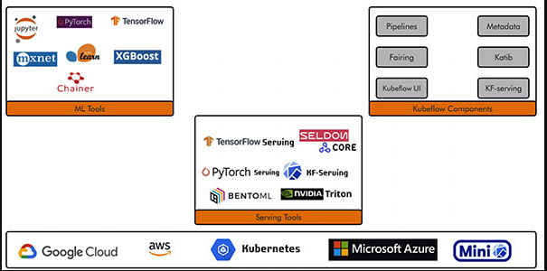
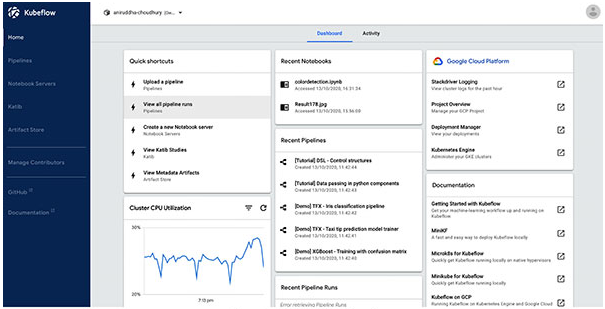

# HyperDL（参考Kubeflow）
这是关于HyperDL产品的书籍（参考Continuous Machine Learning with Kubeflow）


## 1.介绍Kubeflow和Kubernetes架构

## Structure

在本章节，我们将介绍如下内容：

- Docker Understanding
- Kubernetes concepts and architecture(概念和架构)
- Kubernetes components
- Introduction on Kubeflow Orchestration for ML Deployment(ML部署编排简介)
- Components of Kubeflow
- Setting Up for Kubeflow in GCP
- Jupyter Notebook setup
- Optional: PVC setup for Jupyter Notebook

### Objectives(目标)

在本章节，将帮助您了解以下内容：

- 了解Docker和Kubernetes，以及在云上使用它们
- Kubernetes和Kubeflow架构、功能以及优势
- Kubeflow组件和在云平台设置Kubeflow集群
- 在CPU资源中使用Docker镜像以及设置PVC启动Jupyter NoteBook

### 1.1Docker Understanding

Docker is a platform for the developers and system admins to build,run,and share the application with the containers.

- Flexible
- Scalable
- Lightweight
- Portable
- Loosely coupled
- Secure

**Images and Containers**


**Dockerfile**

```
FROM python:3.9
WORDIR /app
COPY requirements.txt .
RUN pip install -y requirements.txt
COPY src/ .
CMD ["python","./server.py"]
```

### 1.2 Kubernetes Architecture

### 1.3 Kubernetes components

### 1.4 Introduction on Kubeflow Orchestration



Kubeflow is the ML toolkit for Kubernetes. The preceding diagram shows Kubeflow as a platform for arranging the components of your ML system on top of Kubernetes.

### 1.5 Components of Kubeflow

The Kubeflow UIs include the following:

- Home, a central dashboard for navigation between the Kubeflow components.
- Pipelines for a Kubeflow Pipelines dashboard.
- Notebook Servers for Jupyter notebooks.
- Katib for hyperparameter tuning.
- Artifact Store for tracking of artifact metadata.
- Manage Contributors for sharing the user access across namespaces in the Kubeflow deployment.



#  2.介绍Kubeflow和Kubernetes架构

