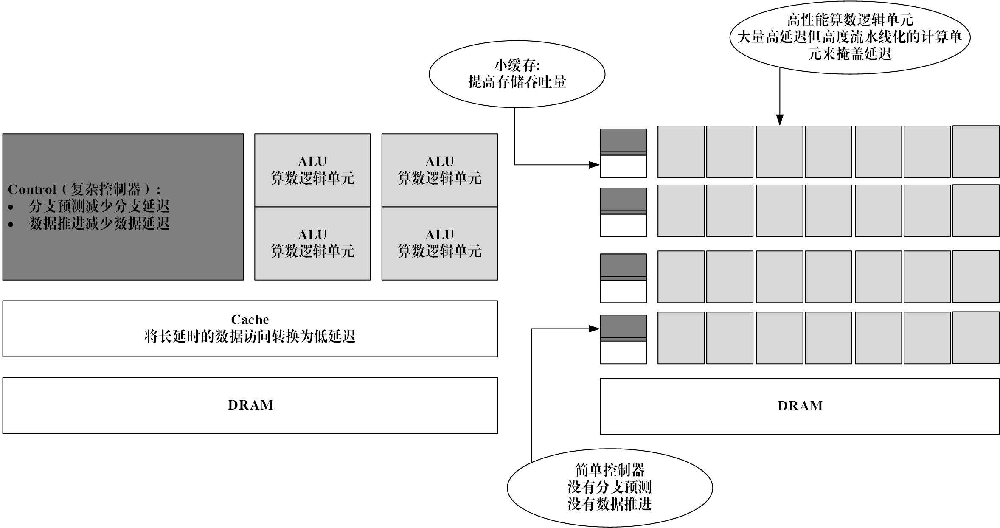

# 文档说明
这是关于海光DCU[开发者社区](https://developer.hpccube.com/tool/#sdk)资源工具，获取DCU生态应用开发简介、使用方法、安装手册等。

## 处理器的异构化成为趋势

 自从新一代芯片被暗硅束缚以来，计算机行业就开始把精力放到了硬件加速器上。他们的想法是：如果不能再增加晶体管，那就好好利用现有的晶体管吧。具体怎么做呢？答案是：专门化。

  传统的 CPU 被设计成通用的，它们使用相同的硬件结构来运行我们所有应用。但是在图形处理中，计算问题往往是一些相似且简单的大量问题，如果把这些问题也放在CPU中会使得CPU应顾不暇，所以将特定的图形处理问题交给GPU来，让CPU去调配GPU来进行计算，CPU可以继续专注于自己擅长的事情。这种同时使用CPU和GPU的程序称为异构程序。

 随着这种异构组合应用的不断发展，GPU从最早的图形处理设备，慢慢发展为通用的异构计算设备。从核心芯片的架构角度来看，CPU是以低延迟为导向的计算单元，通常由专为串行处理而优化的几个核心组成，而GPU是以吞吐量为导向的计算单元，由数以千计的更小、更高效的核心组成，专为并行多任务设计。CPU和GPU设计思路的不同导致微架构的不同。CPU的缓存大于GPU，但在线程数，寄存器数和SIMD（单指令多数据流）方面GPU远强于CPU。微架构的不同最终导致CPU中大部分的晶体管用于构建控制电路和缓存，只有少部分的晶体管完成实际的运算工作，其功能模块很多，擅长分支预测等复杂操作。GPU的流处理器和显存控制器占据了绝大部分晶体管，而控制器相对简单，擅长对大量数据进行简单操作，拥有远胜于CPU的强大浮点计算能力。因此，在相同的晶体管数量下，GPU相对CPU峰值会高一个量级以上，功耗与晶体管的数量成正比，因此GPU的性能功耗比也会比CPU高一个量级以上。因此，以GPGPU为主要计算部件的异构系统将会是解决功耗墙最好的方案。本文所介绍的DCU也是GPGPU计算部件中的一种，它具有与通用GPU类似的架构以及编程方法。

## 异构计算与人工智能的发展

  人工智能的发展离不开三大驱动力，算法、算力以及数据，近些年出现了许多人工智能的颠覆性进展，北京智源人工智能研究院也对2020年的人工智能技术进行了总结，以OpenAI发布的全球最大的预训练模型GPT-3、DeepMind的AlphaFold2破解蛋白质结构预测问题、深度势能分子动力学研究获得戈登贝尔奖、DeepMind等在量子化学领域的发展、美国贝勒医学院通过动态颅内电刺激实现的高效“视皮层打印”、清华大学提出的类脑计算完备性概念及计算系统层次结构、北京大学实现的基于相变存储器的神经网络高速训练系统、MIT用19个类脑神经元实现控制自动驾驶汽车、Google和Facebook提出的SIMCLR和MoCo两个全新的无监督表征学习算法和康内尔大学提出可缓解检索排序马太效应问题的无偏公平排序模型作为最重要的十大技术进展。

  除了算法和技术上的创新，在人工智能算力领域，特别是人工智能芯片、高性能计算和智能计算领域近些年发展及其迅猛。以Nvidia为首的GPU异构加速芯片占据了人工智能的主要算力市场，从Pascal架构到Volta架构到Amper架构，GPU的芯片设计在人工智能领域常用的低精度算力有了显著提升，以A100为代表的新一代GPU加速卡半精度能力已经达到312TFlops，GPU的显存空间为应对更大的网络模型和更高的批处理任务也进行了提升，目前最新的A100加速卡最大可支持80GB的显存空间。在云端训练领域除了Nvidia GPU，AMD GPU等通用计算处理单元也在向AI领域迈进，其新推出的MI60/MI100等加速卡均对AI方向常用的算力进行了提升。在云端推理领域，全球的推理芯片百家争鸣，因为推理芯片在功耗、成本和延时等方面相比于训练有更苛刻的要求，在某些场景下FPGA/ASIC等芯片表现更为突出。以Nvidia、Intel、Google、AMD和Xilinx等为代表的企业占据了全球人工智能芯片行业的主要市场。在人工智能领域，通用计算处理芯片GPU、半定制化的FPGA、全定制化的人工智能ASIC以及神经拟态芯片等在人工智能应用的云端和终端发挥着重要作用。

  国内的人工智能芯片行业发展相对较晚，但是近年来，我国高度关注人工智能芯片产业的发展，相继发布了一系列的芯片产业扶持政策，促进整个国产芯片行业的发展，在“十四五”规划刚要和2035远景目标刚要中就提出了，在“十四五”期间，我国新一代人工智能产业将着重构建开源算法平台，并在学习推理与决策、图像图形等重点领域进行创新，聚焦高端芯片等关键领域。在政策的大力支持下，我国的人工智能芯片发展迅猛，例如海光的通用处理单元DCU、华为的Atlas系列加速芯片、寒武纪的人工智能专用芯片MLU等等。海光作为国内高性能芯片的设计企业，其设计的系列CPU已经达到了国际主流服务器CPU的水平，并实现了规模化应用，异构加速芯片DCU已经在国内多个计算中心部署应用，涉及云端训练、推理以及HPC+AI等多个方向，AI软件栈丰富，是国内AI生态覆盖度最广的一款异构加速芯片。 随着智能汽车、5G网络、机器人等智能化应用的发展，国产AI芯片的应用场景将会越来越广泛，国产化的AI生态也将会越来越完善。

  当前，随着人工智能产业的蓬勃发展和智能化进程，为应对超大规模的自监督训练和大数据量级的推理应用，新型的云端超级智能计算中心将会逐渐增多，为“智慧城市”和“城市大脑”的建设以及人工智能科学研究等提供基础的算力保障，随着新型的人工智能芯片以及前沿的人工智能算法与HPC融合，超级智能计算中心在混合精度、多精度支持能力和低精度计算算力上也将会有突破性的进展，随着AI领域软硬件国产化的趋势，如何使用国产异构计算芯片进行AI领域的相关研发和产业化显得愈发重要。本书以海光DCU作为主要介绍目标，将从DCU架构、编程、基于DCU的AI框架试用使用、调试和优化等多个方面进行讲解。